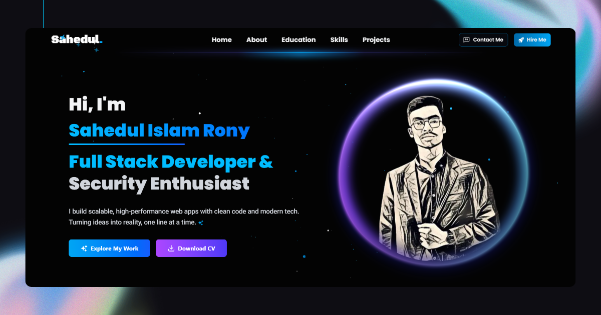
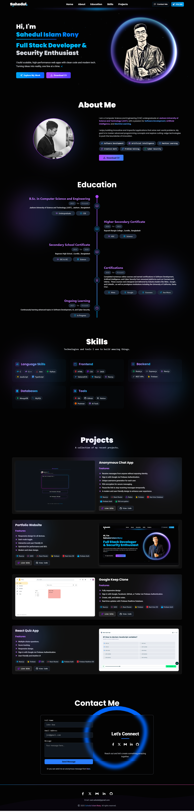

<h1 align="center">🚀 Portfolio 🚀</h1>

**A modern and sleek portfolio website built with cutting-edge web technologies, designed to showcase my projects, skills, and experience.**

    

## Tech Stack & Tools

## 🔥 Features:

- **Next.js** – A React framework for building optimized and server-rendered applications.
- **TypeScript** – A statically typed superset of JavaScript for better code maintainability.
- **Tailwind CSS** – A utility-first CSS framework for building modern and responsive UI.
- **shadcn/ui** – A collection of beautifully styled UI components for faster development.
- **Vercel** – A powerful hosting platform for seamless deployment and performance optimization.
- **Git & GitHub** – Version control and project collaboration tools.
- **VS Code** – The preferred editor for efficient development.

🔗 **Live :** [**Portfolio Website**](https://www.sahedul.me/)

## 🎉 Preview:

## ✨ Sahedul Islam Rony

**`Student/Programmer`**

- **Email:** **cast.sahedul@gmail.com**
- **LinkedIn:** [**@sahedulislamrony**](https://www.linkedin.com/in/sahedulislamrony/)
